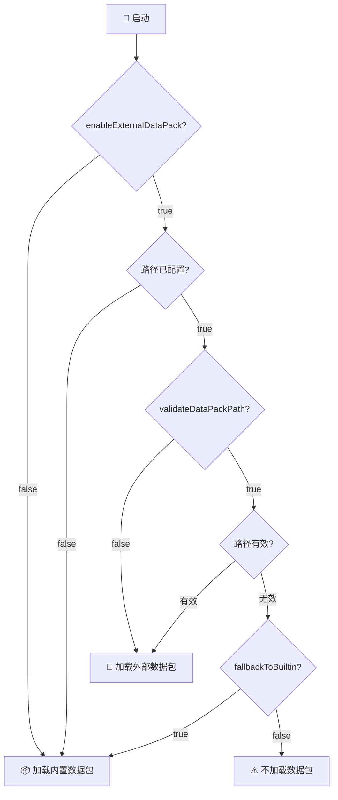

# 📦 ClassBioArsenal 数据包加载配置

---

## 📁 配置文件

**位置**：`config/classbioarsenal/datapack-common.toml`

### 🚀 首次启动

Forge 自动生成配置文件：

- 🎮 **单人游戏**：`.minecraft/config/classbioarsenal/datapack-common.toml`
- 🖥️ **服务器**：`server_root/config/classbioarsenal/datapack-common.toml`

---

## ⚙️ 配置选项

### 1️⃣ `enableExternalDataPack` - 启用外部数据包

```toml
enableExternalDataPack = false
```

**说明**：
- `true` - 🔓 启用外部数据包
- `false` - 🔒 使用内置数据包（默认）

**使用场景**：
- 🎯 需要自定义数据包 → `true`
- 📦 使用默认配置 → `false`

---

### 2️⃣ `externalDataPackPath` - 外部数据包路径

```toml
externalDataPackPath = ""
```

**说明**：
- 📂 指向包含 `pack.mcmeta` 的数据包根目录
- 🔍 留空则使用内置数据包

**路径格式**：

| 系统 | 示例 |
|------|------|
| 🪟 Windows | `C:\Users\Admin\DataPacks\custom_datapack` |
| 🐧 Linux/Mac | `/home/user/datapacks/custom_datapack` |
| 📁 相对路径 | `./datapacks/custom_datapack` |

**示例配置**：

```toml
# Windows 绝对路径
externalDataPackPath = "D:\\Minecraft\\DataPacks\\MyCustomPack"

# Linux 绝对路径
externalDataPackPath = "/home/minecraft/datapacks/my_custom_pack"

# 相对路径（相对于服务器根目录）
externalDataPackPath = "./external_datapacks/custom_pack"
```

---

### 3️⃣ `validateDataPackPath` - 路径验证

```toml
validateDataPackPath = true
```

**说明**：
- `true` - ✅ 启用验证（推荐）
- `false` - ⏭️ 跳过验证

**验证内容**：
- ✅ 路径存在性
- 📁 目录有效性
- 📄 `pack.mcmeta` 文件存在

**建议**：保持 `true` 以确保数据包有效性

---

### 4️⃣ `fallbackToBuiltin` - 回退机制

```toml
fallbackToBuiltin = true
```

**说明**：
- `true` - 🔄 失败时回退到内置数据包（推荐）
- `false` - ⚠️ 失败时不加载数据包

**使用场景**：
- 🏭 生产环境 → `true`
- 🧪 测试环境 → `false`

---

### 5️⃣ `enableEncodingOverride` / `externalDataPackEncoding` - 外部数据包编码

```toml
enableEncodingOverride = false
externalDataPackEncoding = "UTF-8"
```

**说明**：
- `enableEncodingOverride`
  - `false`：始终按 **UTF-8** 读取外部数据包中的 JSON 配置（推荐优先使用 UTF-8 保存文件）
  - `true`：使用下方 `externalDataPackEncoding` 指定的编码来读取外部 JSON
- `externalDataPackEncoding`
  - 使用 Java `Charset.forName` 解析的编码名称（不区分大小写）
  - 只影响 **外部数据包中由本模组 `ConfigManager` 读取的 `data/classbioarsenal/...` JSON**
  - **不会影响** 原版 `assets/.../lang/*.json` 语言文件，它们始终按 UTF-8 解析

**常见编码示例**：

| 编码名        | 场景说明                                |
|---------------|-----------------------------------------|
| `UTF-8`       | 通用 UTF-8 编码（推荐，跨平台一致）     |
| `GBK`         | Windows 简体中文常用编码（ANSI/GBK）    |
| `GB18030`     | GBK 的超集，兼容更多中文字符            |
| `GB2312`      | 早期简体中文编码（一般不再推荐）        |
| `Big5`        | 常见繁体中文编码                        |
| `Shift_JIS`   | 常见日文编码                            |
| `ISO-8859-1`  | 常见西欧语言编码                        |

> ℹ️ 若填写了无法识别的编码名，游戏会在日志中给出警告，并自动回退为 UTF-8

---

## 🔄 加载优先级

### 决策流程



### 优先级表

| 配置状态 | 加载结果 |
|---------|--------|
| `enableExternalDataPack = false` | 📦 内置数据包 |
| 外部路径有效 | 📂 外部数据包 |
| 外部路径无效 + 回退启用 | 📦 内置数据包 |
| 外部路径无效 + 回退禁用 | ⚠️ 不加载数据包 |

---

## 📂 数据包结构

### 标准结构

```
my_custom_datapack/
├── 📄 pack.mcmeta              # 必需：元数据
├── 📁 data/
│   └── 📁 classbioarsenal/     # 模组命名空间
│       ├── 📁 weapon_system/   # 武器系统
│       │   ├── 📄 weapon_config.json
│       │   ├── 📄 rarities.json
│       │   ├── 📄 affixes.json
│       │   └── 📄 leveling.json
│       ├── 📁 armor_system/    # 防具系统
│       │   ├── 📄 armor_config.json
│       │   ├── 📄 armor_rarities.json
│       │   ├── 📄 armor_affixes.json
│       │   └── 📄 armor_leveling.json
│       ├── 📁 professions/     # 职业系统
│       └── 📁 entity_system/   # 实体系统
└── 📁 assets/                  # 可选：资源
```

### pack.mcmeta 示例

```json
{
  "pack": {
    "description": "Custom ClassBioArsenal Data Pack",
    "pack_format": 15
  }
}
```

> 💡 **注意**：Minecraft 1.20.1 使用 `pack_format: 15`

---

## 💡 配置示例

### 📦 默认配置

```toml
[datapack_loading]
enableExternalDataPack = false
externalDataPackPath = ""
validateDataPackPath = true
fallbackToBuiltin = true
enableEncodingOverride = false
externalDataPackEncoding = "UTF-8"
```
> 🎯 **结果**：使用内置数据包

---

### 生产环境

```toml
[datapack_loading]
enableExternalDataPack = true
externalDataPackPath = "D:\\Minecraft\\DataPacks\\MyCustomPack"
validateDataPackPath = true
fallbackToBuiltin = true
enableEncodingOverride = false
externalDataPackEncoding = "UTF-8"
```
> 结果：外部数据包优先，失败时回退到内置

---

### 测试环境

```toml
[datapack_loading]
enableExternalDataPack = true
externalDataPackPath = "./datapacks/test_pack"
validateDataPackPath = true
fallbackToBuiltin = false
enableEncodingOverride = false
externalDataPackEncoding = "UTF-8"
```
> 🎯 **结果**：强制使用外部数据包，失败时不加载

---

### ⚡ 快速模式（不推荐）

```toml
[datapack_loading]
enableExternalDataPack = true
externalDataPackPath = "/home/minecraft/datapacks/custom"
validateDataPackPath = false
fallbackToBuiltin = true
enableEncodingOverride = false
externalDataPackEncoding = "UTF-8"
```
> ⚠️ **结果**：跳过验证，直接加载

---

## ❓ 常见问题

### 🔍 Q1：如何验证数据包加载状态？

查看日志文件：
- 🎮 **单人游戏**：`.minecraft/logs/latest.log`
- 🖥️ **服务器**：`server_root/logs/latest.log`

搜索关键词：`[classbioarsenal] 数据包加载状态:`

```
[classbioarsenal] 数据包加载状态:
  - 外部数据包启用: true
  - 外部数据包路径: D:\DataPacks\MyPack
  - 将加载: 外部数据包
```

---

### 🔄 Q2：修改配置需要重启吗？

✅ **是的** - Forge 在启动时加载配置文件

---

### 📁 Q3：可以使用相对路径吗？

✅ **可以** - 相对于游戏/服务器工作目录

```toml
# 相对路径示例
externalDataPackPath = "./datapacks/custom_pack"
externalDataPackPath = "../shared_datapacks/my_pack"
```

---

### 🛠️ Q4：如何创建自定义数据包？

参考文档：
- 📖 [Minecraft Wiki - Data Pack](https://minecraft.wiki/w/Data_pack)
- 📚 [Minecraft 官方文档](https://docs.microsoft.com/en-us/minecraft/)

ClassBioArsenal 配置指南：
- 🗡️ `GUIDE_WEAPON_ARMOR_CONFIG_CN.md`
- 👥 `GUIDE_PROFESSION_CONFIG_CN.md`
- 👾 `GUIDE_ENTITY_SYSTEM_CONFIG_CN.md`

---

### 🌐 Q5：多模组数据包兼容性？

✅ **完全兼容** - ClassBioArsenal 仅影响本模组数据包

---

### ⚠️ Q6：如何禁用数据包加载？

```toml
[datapack_loading]
enableExternalDataPack = true
externalDataPackPath = "/nonexistent/path"
validateDataPackPath = true
fallbackToBuiltin = false
```
> ⚠️ **警告**：可能导致功能异常

---

## 🔧 故障排查

### ❌ 外部数据包未加载

**检查清单**：
1. ✅ `enableExternalDataPack = true`
2. ✅ 路径正确且存在
3. ✅ 包含 `pack.mcmeta` 文件
4. ✅ 检查日志错误信息
5. ✅ 重启游戏/服务器

**常见错误**：
```
[classbioarsenal] 数据包路径不存在
[classbioarsenal] 数据包路径不是目录
[classbioarsenal] 数据包路径中不存在 pack.mcmeta 文件
```

---

### 📄 配置文件未生成

**解决方案**：
1. ✅ 确认模组已正确安装
2. 🚀 启动游戏生成配置文件
3. 📁 检查 `config/classbioarsenal/` 目录
4. 📝 手动创建 `datapack-common.toml`

---

### 🔄 配置修改未生效

**解决方案**：
1. 💾 保存配置文件
2. ❌ **完全关闭**游戏/服务器
3. 🚀 重新启动
4. 📋 检查日志确认新配置

---

## ℹ️ 版本信息

- 🎮 **模组版本**：ClassBioArsenal 1.20.1
- 🪙 **Minecraft 版本**：1.20.1
- ⚙️ **Forge 版本**：46.0+
- 📦 **数据包格式**：15

---

## 📄 许可证和支持

如有问题或建议，请参考模组官方文档或提交反馈。

